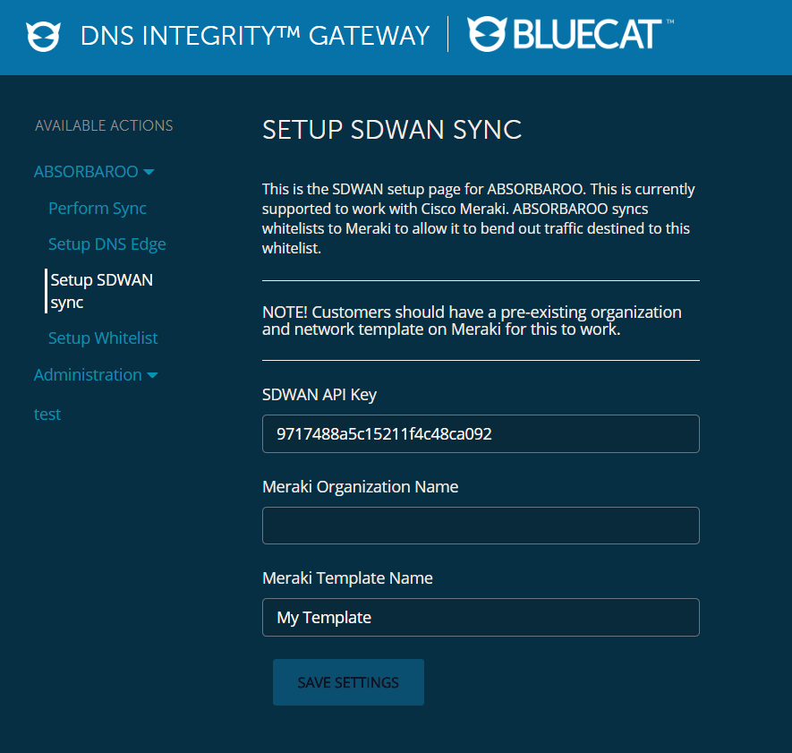
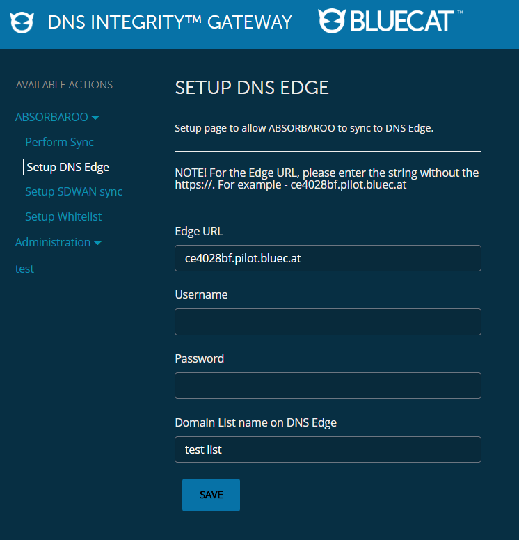
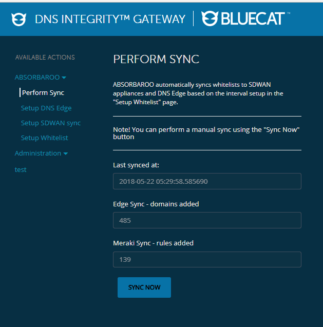

# Absorbaroo

Absorbaroo downloads Office 365 Whitelists and syncs them to DNS Edge and Meraki SD-WAN.

Customers using SD-WAN for traffic optimization can leverage this workflow to allow safe traffic to Office 365 sites.

The following is a typical use case architecture:

## Installation

Absorbaroo runs on the BlueCat Gateway platform.

Copy the ABSORBAROO directory to bluecat_portal/workflows/

`cp -r ABSORBAROO <bluecat_portal>/workflows/`

Install git on the BlueCat Gateway, to download 3rd-party libraries

`apt-get install git`

Install the following 3rd party libraries on BlueCat Gateway

`pip install git+https://github.com/guzmonne/meraki_api.git#egg=meraki_api`

`pip install apscheduler`

This workflow runs a background scheduler thread on Flask that fetches the latest whitelists from Office 365. To start the scheduler, add the following line to `/portal/app.py` in Gateway

`import bluecat_portal.workflows.ABSORBAROO.absorbaroo`

## Usage

The ABSORBAROO workflow has three components that need to be configured via setup pages before it can start to work.
- Setup Whitelist

- Setup SDWAN Sync

- Setup DNS Edge

- Perform a manual Sync (This also happens automatically based on the set interval)

## Overview of files

<pre>
|--- ABSORBAROO (Directory consists of the entire ABSORBAROO workflow)
      |--- Edge.py (DNS Edge class)
      |--- Whitelistdigest.py (The Whitelistdigest class)
      |--- Sdwan.py (The Sdwan class)
      |--- absorbaroo.py (Implements the main function thats run at an interval in the background)
      |--- utils.py (Implements utils to read configuration settings from static files)
</pre>

## Credits
ABSORBAROO is the brainchild of the BlueCat JAPAC team. Thank you for contributing your time to making this project a success.

#### The Team:
- David Jones
- Michael Nonweiler
- Akira Goto
- Ryu Tamura
- Timothy Noel

## License

Copyright 2018 BlueCat Networks (USA) Inc. and its affiliates

Licensed under the Apache License, Version 2.0 (the "License");
you may not use this file except in compliance with the License.
You may obtain a copy of the License at

    http://www.apache.org/licenses/LICENSE-2.0

Unless required by applicable law or agreed to in writing, software
distributed under the License is distributed on an "AS IS" BASIS,
WITHOUT WARRANTIES OR CONDITIONS OF ANY KIND, either express or implied.
See the License for the specific language governing permissions and
limitations under the License.
